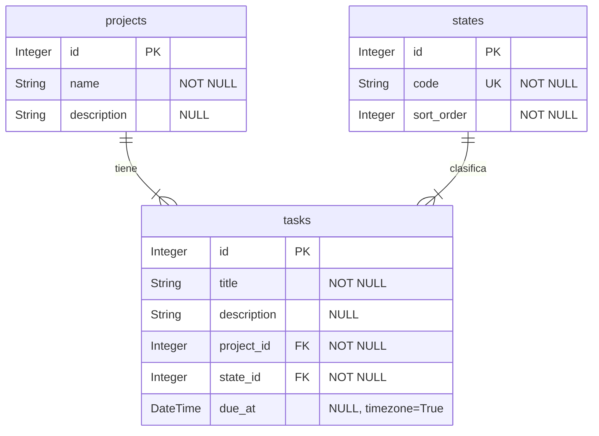

# Esquema de la base de TaskFlow API

Esquema físico de la base de TaskFlow API. Generado a partir de `app/models.py`
y `alembic/versions/`. El comportamiento observable vive en
[`docs/contrato-api.md`](contrato-api.md).

## Fuentes

- **`app/models.py`** — modelos SQLAlchemy: tablas, columnas, tipos,
  `nullable`, `unique`, claves foráneas.
- **`alembic/versions/`** — migraciones, leídas en orden de `down_revision`.
  Aportan en qué revisión entró cada columna, las restricciones del esquema
  físico y los datos sembrados.
- Generado sobre el commit `4f05d93` (rama `feature/descripcion`), sin cambios
  sin commitear en esas rutas.

Cadena de migraciones (lineal, sin ramas ni merges):

```
7a7144ffd331  inicial (raíz, upgrade/downgrade vacíos)
  └─ 306b627a3936  crea tabla states con seed
       └─ e7a3a73c8c3b  crea tabla projects
            └─ 323ce5858585  crea tabla tasks
                 └─ 7d283708c62f  agrega columna due_at a tasks
```

## Diagrama



Ambas relaciones usan cardinalidad `|{` (uno a muchos, lado hijo obligatorio)
porque `tasks.project_id` y `tasks.state_id` son `NOT NULL`. Ninguna clave
foránea declara `ON DELETE`, de modo que rige `NO ACTION`: la base rechaza
borrar un `projects` o un `states` referenciado por alguna fila de `tasks`.

## Diccionario de datos

### `states`

Creada en la revisión `306b627a3936`. No alterada después.

| columna | tipo | nulos | significado |
|---|---|---|---|
| `id` | `Integer` | no | Clave primaria generada por la base. |
| `code` | `String` | no | Código del estado. `UNIQUE`. Valores y su orden: [contrato, sección Estados](contrato-api.md#estados). |
| `sort_order` | `Integer` | no | Posición del estado en el orden del catálogo; desempata por `id`. Ver [orden de las listas](contrato-api.md#orden-de-las-listas). No se expone en la respuesta de la API. |

- Claves foráneas: ninguna.
- La revisión `306b627a3936` siembra el catálogo con `INSERT ... ON CONFLICT
  DO NOTHING` sobre `code` (apoyado en la restricción `UNIQUE (code)`), de modo
  que aplicar la migración dos veces no duplica filas. Los valores sembrados
  están en el [contrato](contrato-api.md#estados).

### `projects`

Creada en la revisión `e7a3a73c8c3b`. No alterada después.

| columna | tipo | nulos | significado |
|---|---|---|---|
| `id` | `Integer` | no | Clave primaria generada por la base. |
| `name` | `String` | no | |
| `description` | `String` | sí | Ausente se devuelve como `null`, no se omite. Ver [esquemas de respuesta](contrato-api.md#esquemas-de-respuesta). |

- Claves foráneas: ninguna.
- El borrado de un proyecto con tareas responde `409`
  ([contrato, sección Proyectos](contrato-api.md#proyectos)); a nivel de base,
  la FK `tasks.project_id` sin `ON DELETE` ya impide el borrado.

### `tasks`

Creada en la revisión `323ce5858585`. Alterada en `7d283708c62f` (columna
`due_at`).

| columna | tipo | nulos | significado |
|---|---|---|---|
| `id` | `Integer` | no | Clave primaria generada por la base. |
| `title` | `String` | no | Se normaliza antes de validar y guardar. Ver [normalización de texto](contrato-api.md#normalización-de-texto). |
| `description` | `String` | sí | Ausente se devuelve como `null`, no se omite. |
| `project_id` | `Integer` | no | FK a `projects.id`. Una referencia a un proyecto inexistente no se crea implícitamente ([contrato, Convenciones](contrato-api.md#convenciones)). |
| `state_id` | `Integer` | no | FK a `states.id`. Una referencia a un estado inexistente no se crea implícitamente. |
| `due_at` | `DateTime(timezone=True)` | sí | Fecha límite con zona horaria. Reglas de aceptación y de serialización en [Tareas v2](contrato-api.md#tareas-v2-fechas-límite) y [esquemas de respuesta](contrato-api.md#esquemas-de-respuesta). Introducida en la revisión `7d283708c62f`; omitirla conserva compatibilidad v1. |

- Claves foráneas:
  - `project_id` → `projects.id`, `ON DELETE NO ACTION` (no declarado).
  - `state_id` → `states.id`, `ON DELETE NO ACTION` (no declarado).
- Ninguna migración añade `CHECK`, `server_default` ni restricción con nombre
  sobre esta tabla.
